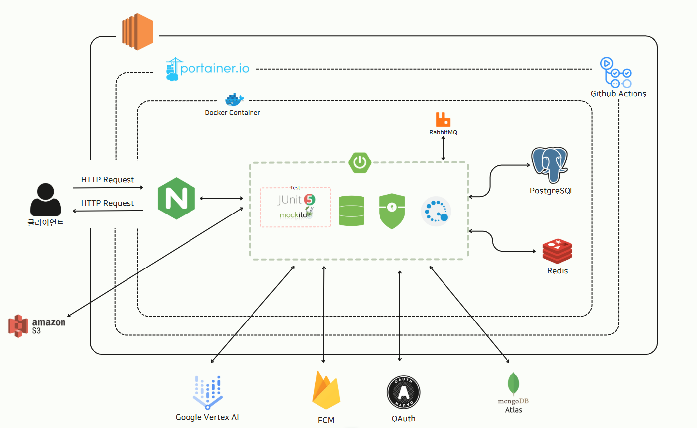

# 🎟️ TicketMate

 

## 📌 프로젝트 소개

**TicketMate**는 치열한 티켓팅 환경 속에서 상대적으로 취약한 사용자들을 위해 시작된 서비스입니다.  
요즘 콘서트나 공연 티켓을 구하기란 매우 어렵고, 손이 느리거나 디지털 환경에 익숙하지 않은 분들은 더욱 불리한 상황에 놓이곤 합니다.

TicketMate는 **티켓팅에 능숙한 사용자들이 어려움을 겪는 사람들을 대신해 안전하고 합리적으로 티켓팅을 도와주는 플랫폼**입니다.  
단순한 대리 구매를 넘어, 신뢰 기반의 매칭과 실시간 소통을 통해 모두가 더 쉽게 티켓을 얻을 수 있는 환경을 만들고자 합니다.

 

## ✨ 주요 기능

- 🔍 **공연 검색 및 대리인 찾기**  
  원하는 공연을 선택하면, 해당 공연을 도와줄 수 있는 대리인 목록과 별점이 함께 표시됩니다.

- ⭐ **신뢰도 높은 대리인 선택**  
  각 대리인의 과거 티켓팅 이력과 별점을 참고해, 원하는 대리인을 직접 선택할 수 있습니다.

- 📝 **간편한 신청서 작성**  
  직관적인 양식에 따라 티켓팅 요청 내용을 빠르게 작성하고, 선택한 대리인에게 바로 전달할 수 있습니다.

- 📬 **신청 상태 실시간 확인**  
  신청 후 대리인의 수락 여부, 처리 상태 등을 앱 내에서 실시간으로 확인할 수 있습니다.

- 💬 **1:1 채팅 기능**  
  대리인이 수락하면 바로 채팅이 열려, 공연 정보나 요청 내용을 자유롭게 소통할 수 있습니다.

- ✅ **진행 완료 후 별점 평가**  
  티켓팅이 끝나면 대리인에게 별점을 남겨 다음 사용자에게도 도움이 되는 피드백을 제공합니다.

 

## 🛣️ 로드맵 (Roadmap)

업데이트 예정 🚧

 

## 🛠 기술 스택

### 🎯 Backend Stack

---

### 💻 Frontend Stack

---

### 🎨 Design Tools

---

### 🧑‍🤝‍🧑 Collaboration Tools

 

## 🏗 Architecture

 

## 👥 팀원 소개

<table>
  <tr>
    <td align="center">
       
      <b>PM</b> 
      <a href="https://github.com/byungjjun">박병준</a>
    </td>
    <td align="center">
       
      <b>PM</b> 
      <a href="https://github.com/seopgyu">김규섭</a>
    </td>
    <td align="center">
       
      <b>BackEnd</b> 
      <a href="https://github.com/mr6208">정우혁</a>
    </td>
    <td align="center">
       
      <b>BackEnd</b> 
      <a href="https://github.com/Chuseok22">백지훈</a>
    </td>
    <td align="center">
       
      <b>BackEnd</b> 
      <a href="https://github.com/Yooonjeong">장윤정</a>
    </td>
    <td align="center">
       
      <b>FrontEnd</b> 
      <a href="https://github.com/imironjin">임철진</a>
    </td>
    <td align="center">
       
      <b>FrontEnd</b> 
      <a href="https://github.com/heesu52">장희수</a>
    </td>
    <td align="center">
       
      <b>Design</b> 
      <a href="https://github.com/76Dosu">김희찬</a>
    </td>
  </tr>
</table>

 
